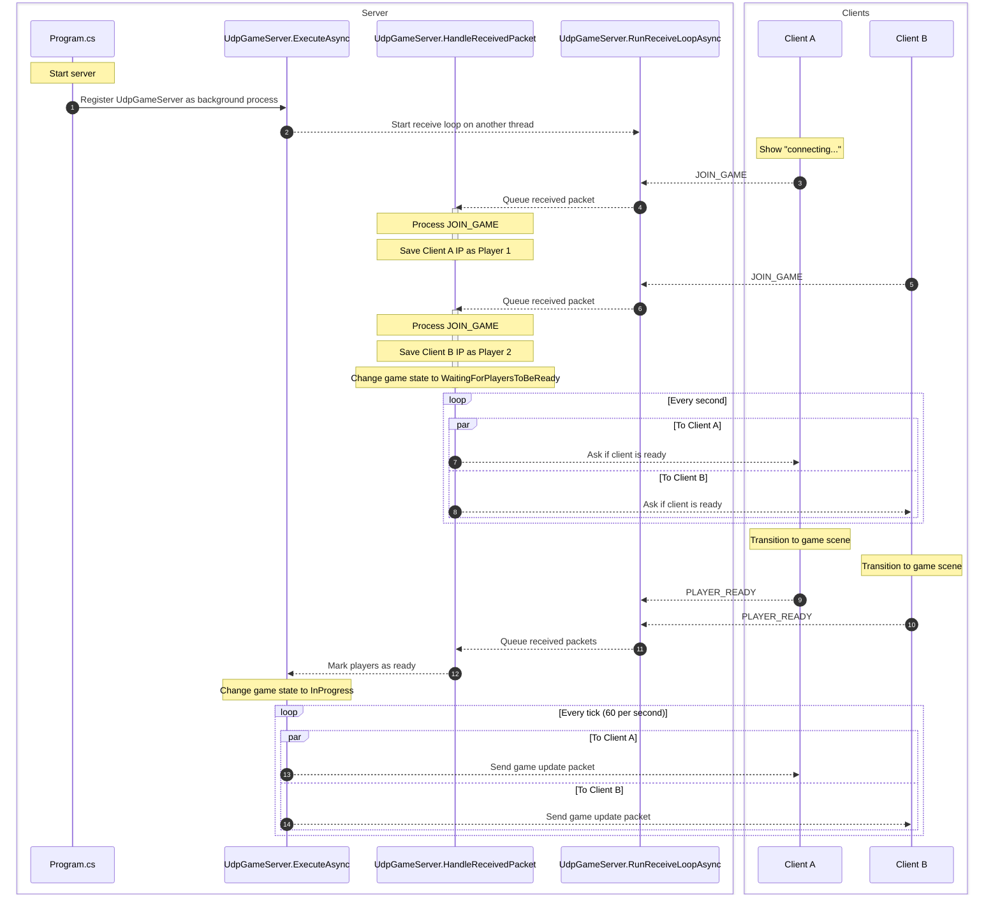

# UDP Game Example (WIP)

This is an example of how to setup an aspnet game server that utilizes UDP protocol to communicate with clients. It also includes a game made using Raylib. In the game, two players connect to a game and compete on who is faster in clicking on randomly appearing shapes.

## How it works (happy path)

